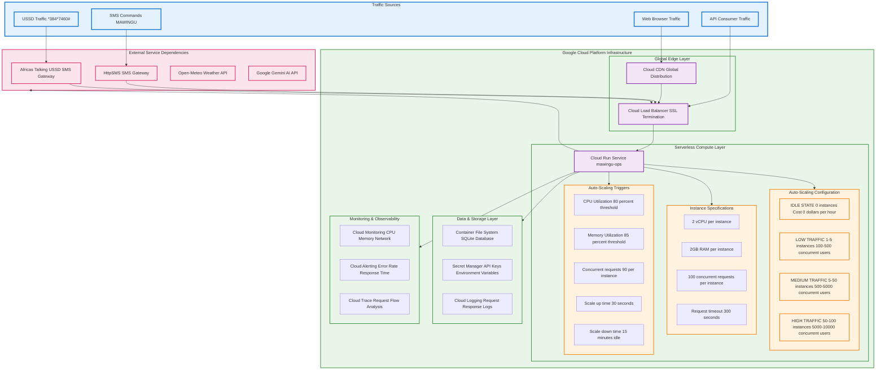
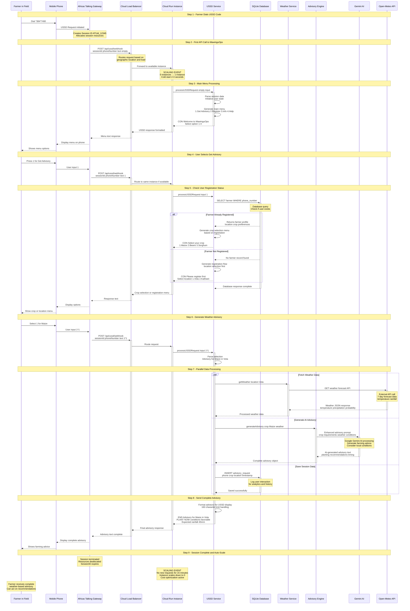

# MawinguOps - Smart Farming Advisory System 🌾

## Architecture Overview

MawinguOps is an AI-powered farming advisory system that provides real-time planting recommendations to smallholder farmers in Machakos County, Kenya through SMS, USSD, and web interfaces.

## System Architecture & Scalability



## USSD User Journey Process Flow



## System Components

### 🚀 **Deployment Platform**
- **Google Cloud Run**: Serverless container platform
- **Region**: us-central1 (Always Free Tier)
- **Resources**: 512MB RAM, 1 vCPU, Auto-scaling 0-5 instances
- **Cost**: $0.00/month within free tier limits

### 📱 **User Interfaces**

#### SMS Interface
- **Gateway**: HttpSMS.com
- **Command**: `MAWINGU [CROP] [LOCATION]`
- **Example**: `MAWINGU MAIZE VOTA`
- **Response**: Detailed farming advisory via SMS

#### USSD Interface
- **Gateway**: Africa's Talking
- **Code**: `*384*7460#`
- **Features**: Interactive menu navigation, offline access
- **Flow**: Main Menu → Crop Selection → Advisory Result

#### Web Interface
- **URL**: `https://mawingu-ops-109647674635.us-central1.run.app`
- **Features**: Interactive form, real-time weather data
- **Technologies**: HTML5, CSS3, Vanilla JavaScript

### 🌐 **External Services**

#### Weather Data
- **Provider**: Open-Meteo API (Free)
- **Coverage**: Vota, Kathiani, Mwala Sub-Counties
- **Data**: Temperature, rainfall, probability forecasts
- **Update Frequency**: Real-time API calls

#### Machine Learning
- **Model**: Scikit-learn Random Forest
- **File**: `maize_planting_model.pkl`
- **Purpose**: Enhance advisory accuracy
- **Fallback**: Rule-based advisory engine

### 🗄️ **Data Layer**

#### SQLite Database
```sql
-- Core Tables
farmers (id, phone_number, name, location, created_at)
advisory_requests (id, farmer_id, crop, location, recommendation, weather_data, request_time)
sms_logs (id, phone_number, message_content, direction, timestamp, status)
weather_cache (id, location, weather_data, fetched_at, expires_at)
```

#### Crop Support
- **Maize**: 18°C-32°C, 40mm+ rainfall
- **Beans**: 16°C-30°C, 35mm+ rainfall  
- **Sorghum**: 20°C-35°C, 30mm+ rainfall

### 🔌 **API Endpoints**

#### Core APIs
```
GET  /api/health          - Health check
GET  /api/locations       - Available locations
POST /api/advisory        - Get farming advisory
POST /api/sms/webhook     - SMS webhook handler
POST /api/ussd/webhook    - USSD webhook handler
```

#### Development APIs
```
POST /api/ussd/test       - Test USSD flows
GET  /ussd-simulator.html - USSD development interface
```

## Request Flow Examples

### SMS Advisory Request
```
1. Farmer sends: "MAWINGU MAIZE VOTA"
2. HttpSMS webhook → MawinguOps server
3. Parse command → Get weather data → Generate advisory
4. ML enhancement (if available) → Save to database
5. Send detailed SMS response to farmer
```

### USSD Session Flow
```
1. Farmer dials: *384*7460#
2. Africa's Talking → USSD webhook
3. Display main menu (CON response)
4. User selects crop → Generate advisory
5. Return final advisory (END response)
```

### Web Advisory Request
```
1. User visits web interface
2. Select crop/location → AJAX POST to /api/advisory
3. Server processes → Returns JSON advisory
4. Frontend displays formatted advisory
```

## Technical Features

### 🛡️ **Reliability**
- Error handling with graceful fallbacks
- ML model availability detection
- Weather API timeout handling
- Database connection retry logic

### 📊 **Performance**
- Request logging and analytics
- Weather data caching
- Lightweight SQLite database
- Efficient message generation

### 🔐 **Security**
- Environment variable configuration
- Input validation and sanitization
- Rate limiting considerations
- Secure webhook handling

### 🌍 **Scalability**
- Serverless auto-scaling
- Stateless application design
- External service integration
- Multi-channel support

## Getting Started

### Local Development
```bash
git clone <repository-url>
cd mawinguops
npm install
cp .env.example .env  # Add your API keys
npm start
```

### Deployment
```bash
./deploy-simple.ps1  # Deploys to Google Cloud Run
```

### Testing USSD
```bash
# Local testing
curl -X POST http://localhost:3000/api/ussd/test \
  -H "Content-Type: application/json" \
  -d '{"phoneNumber":"+254703844258","text":""}'
```

---

